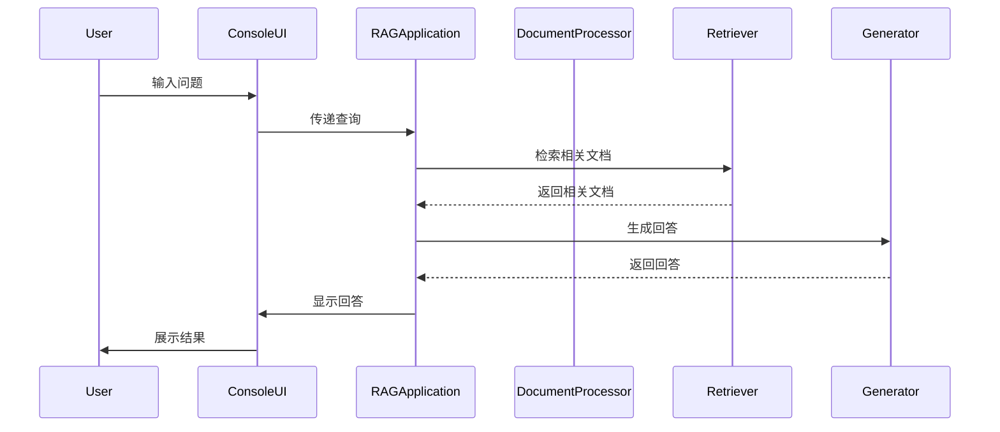

# Tutorial RAG Assistant

基于 RAG (Retrieval Augmented Generation) 架构的智能教程问答系统，专注于提供准确、专业的教程内容解答。

## 特性

- 🚀 混合检索策略：结合 BM25 和向量检索的集成检索方案
- 📚 智能文档处理：自适应文本分块，支持教程编号精准过滤
- 💡 高性能：基于 ChromaDB 的向量存储，支持增量索引
- 🛠 完整工程实践：异常处理、日志监控、优雅降级

## 技术栈

- Python 3.8+
- LangChain
- OpenAI API (GPT-4 & Embeddings)
- ChromaDB
- Pydantic

## 快速开始

1. 克隆项目
```bash
git clone https://github.com/yourusername/tutorial-rag.git
cd tutorial-rag
```

2. 安装依赖
```bash
pip install -r requirements.txt
```

3. 配置环境变量
```bash
cp .env.example .env
# 编辑 .env 文件，添加你的 OpenAI API Key
```

4. 运行示例
```bash
python src/main.py
```

## 项目结构

```
src/
├── application.py  # 应用主类
├── retriever.py    # 检索模块
├── generator.py    # 答案生成模块
└── ...
```

## 使用示例

```python
from config import RAGConfig
from application import RAGApplication

config = RAGConfig(openai_api_key="your-api-key")
app = RAGApplication(config)
app.initialize()

response = app.answer_question("Tutorial 1 的主要内容是什么？")
print(response)
```

## 系统架构



## 开源协议

MIT License